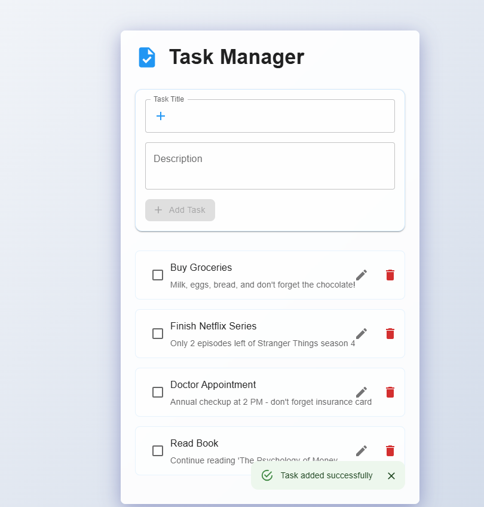

# Task Management Application

A full-stack task management application built with Node.js, Express, SQLite, React, and Material-UI.

## Features

- Create, read, update, and delete tasks
- Mark tasks as complete/incomplete
- Edit task details
- Responsive design
- Modern Material-UI components
- SQLite database for data persistence

## Tech Stack

### Backend
- Node.js
- Express
- SQLite3
- MVC Architecture

### Frontend
- React
- Vite
- Material-UI
- Axios

## Project Structure

```
.
├── backend/           # Node.js + Express backend
│   ├── config/       # Database configuration
│   ├── controllers/  # Request handlers
│   ├── models/      # Data models
│   ├── routes/      # API routes
│   └── server.js    # Main server file
└── frontend/         # React frontend
    ├── src/         # Source files
    ├── public/      # Static files
    └── README.md    # Frontend documentation
```

## Prerequisites

- Node.js (v14 or higher)
- npm (v6 or higher)

## Setup Instructions

### Backend Setup

1. Navigate to the backend directory:
```bash
cd backend
```

2. Install dependencies:
```bash
npm install
```

3. Start the server:
```bash
node server.js
```

The backend server will run on `http://localhost:5000`.

### Frontend Setup

1. Navigate to the frontend directory:
```bash
cd frontend
```

2. Install dependencies:
```bash
npm install
```

3. Start the development server:
```bash
npm run dev
```

The frontend application will be available at `http://localhost:5173`.

## API Documentation

### Base URL
```
https://your-render-app-name.onrender.com
```

### Endpoints

#### 1. Get All Tasks
- **Method**: GET
- **URL**: `/tasks`
- **Response**: List of all tasks
```json
[
  {
    "id": 1,
    "title": "Complete Project Documentation",
    "description": "Update README files and add API documentation",
    "completed": false
  }
]
```

#### 2. Create New Task
- **Method**: POST
- **URL**: `/tasks`
- **Headers**: 
  ```
  Content-Type: application/json
  ```
- **Request Body**:
```json
{
  "title": "Complete Project Documentation",
  "description": "Update README files and add API documentation"
}
```
- **Response**: Created task object

#### 3. Get Single Task
- **Method**: GET
- **URL**: `/tasks/:id`
- **Response**: Single task object
```json
{
  "id": 1,
  "title": "Complete Project Documentation",
  "description": "Update README files and add API documentation",
  "completed": false
}
```

#### 4. Update Task
- **Method**: PUT
- **URL**: `/tasks/:id`
- **Headers**:
  ```
  Content-Type: application/json
  ```
- **Request Body**:
```json
{
  "title": "Updated Task Title",
  "description": "Updated task description",
  "completed": true
}
```
- **Response**: Updated task object

#### 5. Delete Task
- **Method**: DELETE
- **URL**: `/tasks/:id`
- **Response**: Success message

### Testing with Postman

1. **Import Postman Collection**
   - Download the Postman collection from: [Postman Collection Link]
   - Import it into your Postman workspace

2. **Set Up Environment**
   - Create a new environment in Postman
   - Add variable:
     - Name: `baseUrl`
     - Value: `https://your-render-app-name.onrender.com`

3. **Test Data**
   Use these sample tasks for testing:
   ```json
   // Task 1
   {
     "title": "Complete Project Documentation",
     "description": "Update README files and add API documentation"
   }

   // Task 2
   {
     "title": "Implement User Authentication",
     "description": "Add JWT-based authentication system"
   }

   // Task 3
   {
     "title": "Design Database Schema",
     "description": "Create ERD and implement database migrations"
   }
   ```

4. **Testing Steps**
   1. Create tasks using POST endpoint
   2. Get all tasks using GET endpoint
   3. Get a single task using GET with ID
   4. Update a task using PUT endpoint
   5. Delete a task using DELETE endpoint
   6. Verify deletion using GET all tasks

### Error Responses
```json
// 404 Not Found
{
  "error": "Task not found"
}

// 400 Bad Request
{
  "error": "Title is required"
}

// 500 Server Error
{
  "error": "Something went wrong!"
}
```

## Screenshots

### Main Task List View


